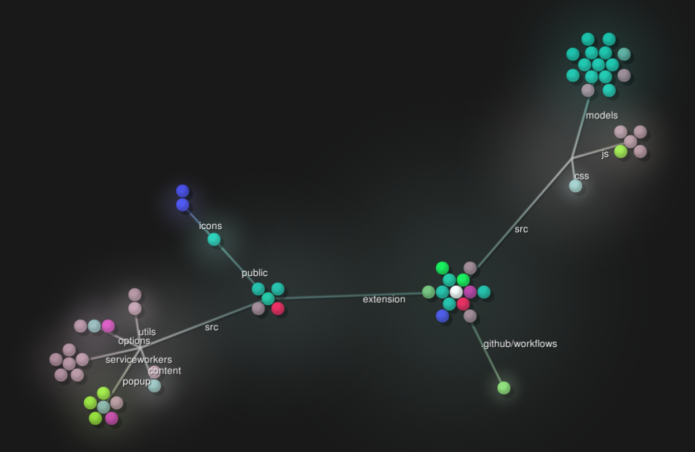

<p align="center">
  <a href="https://do-me.github.io/SemanticFinder/">
    
  </a>    
<h1 align="center">Frontend-only live semantic search and chat-with-your-documents built on transformers.js</h1>
</p>


## [Try the web app](https://do-me.github.io/SemanticFinder/), [install the Chrome extension](#browser-extension) or read the [introduction blog post](https://geo.rocks/post/semanticfinder-semantic-search-frontend-only/).

Semantic search right in your browser! Calculates the embeddings and cosine similarity client-side without server-side inferencing, using [transformers.js](https://xenova.github.io/transformers.js/) and latest SOTA embedding models from Huggingface.

## Models
All transformers.js-compatible feature-extraction models are supported. Here is a sortable list you can go through: [daily updated list](https://do-me.github.io/trending-huggingface-models/). Download the compatible models table as xlsx, csv, json, parquet, or html here: https://github.com/do-me/trending-huggingface-models/.

## Catalogue 
You can use super fast pre-indexed examples for *really* large books like the Bible or Les Misérables with hundreds of pages and search the content in less than 2 seconds 🚀. Try one of these and convince yourself:

| filesize | textTitle | textAuthor | textYear | textLanguage | URL | modelName | quantized | splitParam | splitType | characters | chunks | wordsToAvoidAll | wordsToCheckAll | wordsToAvoidAny | wordsToCheckAny | exportDecimals | lines | textNotes | textSourceURL | filename |
| --- | --- | --- | --- | --- | --- | --- | --- | --- | --- | --- | --- | --- | --- | --- | --- | --- | --- | --- | --- | --- |
| 4.78 | Das Kapital | Karl Marx | 1867 | de | https://do-me.github.io/SemanticFinder/?hf=Das_Kapital_c1a84fba | Xenova/multilingual-e5-small | True | 80 | Words | 2003807 | 3164 |  |  |  |  | 5 | 28673 |  | https://ia601605.us.archive.org/13/items/KarlMarxDasKapitalpdf/KAPITAL1.pdf | Das_Kapital_c1a84fba.json.gz |
| 2.58 | Divina Commedia | Dante | 1321 | it | https://do-me.github.io/SemanticFinder/?hf=Divina_Commedia_d5a0fa67 | Xenova/multilingual-e5-base | True | 50 | Words | 383782 | 1179 |  |  |  |  | 5 | 6225 |  | http://www.letteratura-italiana.com/pdf/divina%20commedia/08%20Inferno%20in%20versione%20italiana.pdf | Divina_Commedia_d5a0fa67.json.gz |
| 11.92 | Don Quijote | Miguel de Cervantes | 1605 | es | https://do-me.github.io/SemanticFinder/?hf=Don_Quijote_14a0b44 | Xenova/multilingual-e5-base | True | 25 | Words | 1047150 | 7186 |  |  |  |  | 4 | 12005 |  | https://parnaseo.uv.es/lemir/revista/revista19/textos/quijote_1.pdf | Don_Quijote_14a0b44.json.gz |
| 0.06 | Hansel and Gretel | Brothers Grimm | 1812 | en | https://do-me.github.io/SemanticFinder/?hf=Hansel_and_Gretel_4de079eb | TaylorAI/gte-tiny | True | 100 | Chars | 5304 | 55 |  |  |  |  | 5 | 9 |  | https://www.grimmstories.com/en/grimm_fairy-tales/hansel_and_gretel | Hansel_and_Gretel_4de079eb.json.gz |
| 1.74 | IPCC Report 2023 | IPCC | 2023 | en | https://do-me.github.io/SemanticFinder/?hf=IPCC_Report_2023_2b260928 | Supabase/bge-small-en | True | 200 | Chars | 307811 | 1566 |  |  |  |  | 5 | 3230 | state of knowledge of climate change | https://report.ipcc.ch/ar6syr/pdf/IPCC_AR6_SYR_LongerReport.pdf | IPCC_Report_2023_2b260928.json.gz |
| 25.56 | King James Bible |  | None | en | https://do-me.github.io/SemanticFinder/?hf=King_James_Bible_24f6dc4c | TaylorAI/gte-tiny | True | 200 | Chars | 4556163 | 23056 |  |  |  |  | 5 | 80496 |  | https://www.holybooks.com/wp-content/uploads/2010/05/The-Holy-Bible-King-James-Version.pdf | King_James_Bible_24f6dc4c.json.gz |
| 11.45 | King James Bible |  | None | en | https://do-me.github.io/SemanticFinder/?hf=King_James_Bible_6434a78d | TaylorAI/gte-tiny | True | 200 | Chars | 4556163 | 23056 |  |  |  |  | 2 | 80496 |  | https://www.holybooks.com/wp-content/uploads/2010/05/The-Holy-Bible-King-James-Version.pdf | King_James_Bible_6434a78d.json.gz |
| 39.32 | Les Misérables | Victor Hugo | 1862 | fr | https://do-me.github.io/SemanticFinder/?hf=Les_Misérables_2239df51 | Xenova/multilingual-e5-base | True | 25 | Words | 3236941 | 19463 |  |  |  |  | 5 | 74491 | All five acts included | https://beq.ebooksgratuits.com/vents/Hugo-miserables-1.pdf | Les_Misérables_2239df51.json.gz |
| 0.46 | REGULATION (EU) 2023/138 | European Commission | 2022 | en | https://do-me.github.io/SemanticFinder/?hf=REGULATION_(EU)_2023_138_c00e7ff6 | Supabase/bge-small-en | True | 25 | Words | 76809 | 424 |  |  |  |  | 5 | 1323 |  | https://eur-lex.europa.eu/legal-content/EN/TXT/PDF/?uri=CELEX:32023R0138&qid=1704492501351 | REGULATION_(EU)_2023_138_c00e7ff6.json.gz |
| 0.07 | Universal Declaration of Human Rights | United Nations | 1948 | en | https://do-me.github.io/SemanticFinder/?hf=Universal_Declaration_of_Human_Rights_0a7da79a | TaylorAI/gte-tiny | True | \nArticle  | Regex | 8623 | 63 |  |  |  |  | 5 | 109 | 30 articles | https://www.un.org/en/about-us/universal-declaration-of-human-rights | Universal_Declaration_of_Human_Rights_0a7da79a.json.gz |

## Import & Export 

You can create indices yourself with one two clicks and save them. If it's something private, keep it for yourself, if it's a classic book or something you think other's might be interested in consider a PR on the [Huggingface Repo](https://huggingface.co/datasets/do-me/SemanticFinder) or get in touch with us. Book requests are happily met if you provide us a good source link where we can do copy & paste. Simply open an issue here with [Book Request] or similar or contact us. 

It goes without saying that no discriminating content will be tolerated.

## Installation 

Clone the repository and install dependencies with 

`npm install`

Then run with

`npm run start`

If you want to build instead, run 

`npm run build`

Afterwards, you'll find the `index.html`, `main.css` and `bundle.js` in `dist`.

## Browser extension 
Download the Chrome extension from [Chrome webstore](https://chrome.google.com/webstore/detail/semanticfinder/ddmgffoffelnhnonpoiblaoboaeieejl) and pin it. Right click the extension icon for `options`: 
- choose distiluse-base-multilingual-cased-v2 for multilingual usage (default is English-only)
- set a higher number for min characters to split by for larger texts


### Local build 
If you want to build the browser extension locally, clone the repo and cd in `extension` directory then run: 
- `npm install`
- `npm run build` for a static build or
- `npm run dev` for the auto-refreshing development version
- go to Chrome extension settings with `chrome://extensions`
- select `Load Unpacked` and choose the `build` folder
- pin the extension in Chrome so you can access it easily. If it doesn't work for you, feel free to open an issue.

## Speed 
Tested on the entire book of [Moby Dick](https://archive.org/stream/mobydickorwhale01melvuoft/mobydickorwhale01melvuoft_djvu.txt) with 660.000 characters ~13.000 lines or ~111.000 words. 
Initial embedding generation takes **1-2 mins** on my old i7-8550U CPU with 1000 characters as segment size. Following queries take only ~2 seconds! 
If you want to query larger text instead or keep an entire library of books indexed use a [proper vector database instead](https://geo.rocks/post/qdrant-transformers-js-semantic-search/). 

## Features

You can customize everything!

- Input text & search term(s)
- Hybrid search (semantic search & full-text search)
- Segment length (the bigger the faster, the smaller the slower)
- Highlight colors (currently hard-coded)
- Number of highlights are based on the threshold value. The lower, the more results.
- Live updates
- Easy integration of other ML-models thanks to [transformers.js](https://xenova.github.io/transformers.js/)
- Data privacy-friendly - your input text data is not sent to a server, it stays in your browser!

## Usage ideas

- Basic search through anything, like your personal notes (my initial motivation by the way, a huge notes.txt file I couldn't handle anymore)
- Remember peom analysis in school? Often you look for possible Leitmotifs or recurring categories like **food** in Hänsel & Gretel

## Future ideas

- One could package everything nicely and use it e.g. instead of JavaScript search engines such as [Lunr.js](https://lunrjs.com/) (also being used in [mkdocs-material](https://squidfunk.github.io/mkdocs-material/setup/setting-up-site-search/)).
- Integration in mkdocs (mkdocs-material) **experimental**:
    - when building the docs, slice all `.md`-files in chunks (length defined in `mkdocs.yaml`). Should be fairly large (>800 characters) for lower response time. It's also possible to build n indices with first a coarse index (mabye per document/ `.md`-file if the used model supports the length) and then a rfined one for the document chunks
    - build the index by calculating the embeddings for all docs/chunks 
    - when a user queries the docs, a switch can toggle (fast) full-text standard search (atm with lunr.js) or experimental semantic search 
    - if the latter is being toggled, the client loads the model (all-MiniLM-L6-v2 has ~30mb) 
    - like in SemanticFinder, the embedding is created client-side and the cosine similarity calculated 
    - the high-scored results are returned just like with lunr.js so the user shouldn't even notice a differenc ein the UI
- Electron- or browser-based apps could be augmented with semantic search, e.g. VS Code, Atom or mobile apps. 
- Integration in personal wikis such as Obsidian, tiddlywiki etc. would save you the tedious tagging/keywords/categorisation work or could at least improve your structure further
- Search your own browser history (thanks [@Snapdeus](https://twitter.com/snapdeus/status/1646233904691413006))
- Integration in chat apps
- Allow PDF-uploads (conversion from PDF to text) 
- Integrate with Speech-to-Text whisper model from transformers.js to allow audio uploads.
- Thanks to [CodeMirror](https://codemirror.net/) one could even use syntax highlighting for programming languages such as Python, JavaScript etc. 

## Logic 

[Transformers.js](https://xenova.github.io/transformers.js/) is doing all the heavy lifting of tokenizing the input and running the model. Without it, this demo would have been impossible. 

**Input**
- Text, as much as your browser can handle! The demo uses a part of "Hänsel & Gretel" but it can handle hundreds of PDF pages
- A search term or phrase
- The number of characters the text should be segmented in
- A similarity threshold value. Results with lower similarity score won't be displayed.

**Output**
- <span style="background-color: rgb(0, 255, 81);">Three highlighted string segments</span>, the darker the higher the similarity score.

**Pipeline**

0. All scripts are loaded. The model is loaded once from HuggingFace, after cached in the browser.
1. A user inputs some text and a search term or phrase.
2. Depending on the approximate length to consider (unit=characters), the text is split into **segments**. Words themselves are never split, that's why it's approximative.
3. The search term embedding is created.
4. For each **segment** of the text, the embedding is created. 
5. Meanwhile, the cosine similarity is calculated between every **segment** embedding and the search term embedding. It's written to a dictionary with the segment as key and the score as value.
6. For every iteration, the progress bar and the highlighted sections are updated in real-time depending on the highest scores in the array.
7. The embeddings are cached in the dictionary so that subsequent queries are quite fast. The calculation of the cosine similarity is fairly speedy in comparison to the embedding generation. 
8. **Only if the user changes the segment length**, the embeddings must be recalculated.  

## Collaboration 
PRs welcome!

## To Dos (no priorization)
- [x] similarity score cutoff/threshold
- [x] add option for more highlights (e.g. all above certain score)
- [x] add stop button 
- [x] MaterialUI for input fields or proper labels
- [x] create a demo without CDNs
- [x] separate one html properly in html, js, css
- [x] add npm installation 
- [x] option for loading embeddings from file or generally allow sharing embeddings in some way
- [x] simplify chunking function so the original text can be loaded without issues
- [ ] improve the color range
- [ ] rewrite the cosine similarity function in Rust, port to WASM and load as a module for possible speedup (experimental)
- [ ] UI overhaul
- [ ] polish code 
- [x]   - jQuery/vanilla JS mixed
- [ ]   - clean up functions 
- [ ]   - add more comments
- [ ] add possible use cases
- [ ] package as a standalone application (maybe with custom model choice; to be downloaded once from HF hub, then saved locally)
- [ ] possible integration as example in [transformers.js homepage](https://github.com/xenova/transformers.js/issues/84)

## Star History

[](https://star-history.com/#do-me/SemanticFinder&Timeline)

## Gource Map 



Gource image created with: 

```bash 
gource -1280x720 --title "SemanticFinder" --seconds-per-day 0.03 --auto-skip-seconds 0.03 --bloom-intensity 0.5 --max-user-speed 500 --highlight-dirs --multi-sampling --highlight-colour 00FF00  
```
